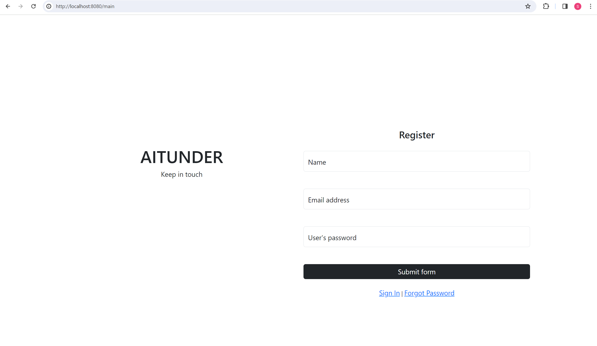
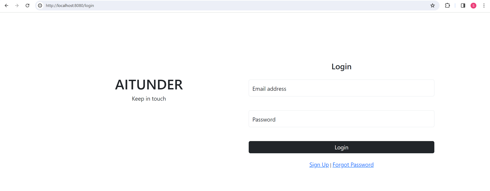

# Aitunder

**Team Members:** Beisenov Zhangeldy (SE-2208), Ali Samal (SE-2219)

**A brief discussion on project relevance/motivations and principles of operations**

The main problem is the problem of finding partners among university students. Because of this, there is a need to create a favorable environment for the development of students' social life, the creation of new ideas and projects. Therefore, we had the idea to create a website to search for like-minded people or events of interest to AITU students.

We were inspired by the concept of Tinder, but its functionality is not suitable for creating a working atmosphere, so we found some solutions in Headhunter. 
Tinder is an application for online dating and geosocial networks. On Tinder, users "swipe right" to like, or "swipe left" to dislike other users' profiles, which include their photos, a brief biography and a list of their interests. Tinder uses a "double sign-up" system where both users have to like each other before they can exchange messages.

Tinder features that will be implemented in this project: (*in order to understand how it will work*)

- Swipe is central to Tinder's design. The app's algorithm presents profile to users, who then swipe right to "like" potential matches and swipe left to continue their search.
- Messaging is also a heavily utilized feature. Once a user matches with another user, they are able to exchange text messages on the app.

**Technical specifications of the project**

1.  HTML Templates:

    -   `login.html`: Represents the login page interface, containing the login form and associated elements.
    -   `registration.html`: Represents the registration page interface, containing the registration form with additional fields for user information.

2.  Go (Golang) Server and Routing:

    -   `main.go`: Serves as the main entry point for the Go application. It initializes and starts the HTTP server, handles routing for different URL paths ("/main", "/login", "/home"), and includes logic to serve corresponding HTML templates based on the requested path. Additionally, it defines API endpoints ("/api/signUp" and "/api/login") for user registration and authentication.

3.  MongoDB Operations:

    -   Helper Functions (`helper.go`):

        -   `insertOneUser(user models.User)`: Inserts a new user into the MongoDB database.
        -   `deleteOneUser(userId string)`: Deletes a user from the database based on their ID.
        -   `getAllUsers() []primitive.D`: Retrieves all users from the database as an array of BSON documents.
        -   `getOneUserByEmail(email string) (*models.User, error)`: Retrieves a user by their email address.
    -   Controller Functions (`controller.go`):

        -   `init()`: Initializes the MongoDB connection and sets up the MongoDB collection.
        -   `GetAllUsers(w http.ResponseWriter, r *http.Request)`: Handles the HTTP GET request to retrieve all users and responds with JSON data.
        -   `AddUser(w http.ResponseWriter, r *http.Request)`: Handles the HTTP POST request to add a new user to the database and responds with the added user's JSON data.
        -   `LoginHandler(w http.ResponseWriter, r *http.Request)`: Handles the HTTP POST request for user login, checking credentials against the database and responding accordingly.

4.  User Model:

    -   `models.go`: Defines the data model for the user entity. The `User` struct includes fields such as ID, Name, Email, and Password, mapped to MongoDB BSON properties.

**Step-by-step instructions for launching the application (server, webpage, etc.)**

hereeeee .......................

**Future features and technical solutions:**

НАДО ИСПРАВИТЬ ИЛИ УДАЛИТЬ СОВСЕМ ХЗ

- Swipe-able cards with swipe animations (JS)
- Matching algorithm
- Context API with a custom AuthProvider & useAuth hook
- Navigation including popup Modals
- Registration and/or login
- Creating profile questionnaires
- Possibility of choice - refusal or approval (swipe cards)
- Matching users together who swipe on each other

**Tools used, links to sources:**

https://www.youtube.com/watch?v=laeZI6UdDNg&list=PLRAV69dS1uWQGDQoBYMZWKjzuhCaOnBpa&index=43&ab_channel=HiteshChoudhary
